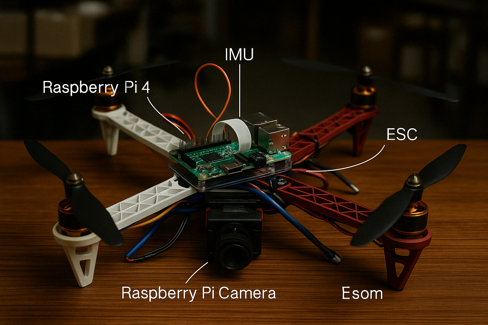

# Surveillance Quadcopter Drone – वेग (Veg)

**वेग** ("speed" in Sanskrit) is a surveillance quadcopter first built as a major B.Tech project. It was later upgraded with SLAM-based autonomy, fault-tolerant control and onboard computer vision.



## 🚀 Highlights

- **SLAM-based navigation**
  ORB-SLAM3 (monocular-inertial) provides real-time 6-DoF pose. RTAB-Map produces post-mission dense 3D reconstruction.

- **Cascaded control**
  - **Inner loop (Arduino, 250 Hz):** LQR attitude stabilisation, or PID, switchable at runtime. Gains are generated from the plant model by `compute_lqr_gains.m`.
  - **Outer loop (Raspberry Pi, 20 Hz):** position PD with feed-forward and altitude PID, closed on the SLAM pose.

- **Fault detection and safety**
  - Arming only when level, with throttle low and the link alive.
  - A 500 ms link-loss watchdog triggers a controlled failsafe descent.
  - Loss of attitude tracking (e.g. rotor or prop failure) also triggers the failsafe descent.
  - Motors are cut on a crash or flip (> 60° tilt) and on an IMU/I²C failure.

- **Onboard vision**
  - YOLO object detection (YOLOv5n/YOLOv8n ONNX via OpenCV DNN, 80 COCO classes, NMS)
  - PCA (eigenface) face recognition

- **Simulation**
  MATLAB/Simulink scripts for controller comparison (PID, FBL+PD, LQR), a Dijkstra maze planner, and a Python closed-loop simulator for the outer loop.

---

## 📂 Repository Structure

```
veg-slam-drone/
├── README.md
├── LICENSE
├── Final_Veg_Drone.png, Veg_FINAL_Flight.gif
├── firmware/
│   ├── veg_flight_controller/   # Arduino sketch: IMU fusion, LQR/PID, failsafe, FDI, serial protocol
│   │   ├── veg_flight_controller.ino
│   │   └── config.h             # gains, limits, pins, sign conventions
│   ├── test/                    # host-side behaviour tests (make)
│   └── README.md                # protocol, safety behaviour, bench-test checklist
├── software/
│   ├── slam/
│   │   ├── orbslam3_ros/        # launch + camera/IMU config
│   │   └── rtabmap_configs/     # launch + params
│   ├── control/trajectory_controller.py   # outer loop (ROS pose or --sim)
│   ├── utils/serial_comm.py               # Pi <-> Arduino link
│   └── vision/                  # object detection, face recognition, combined node, overlay demo
├── veg-slam-drone-sim/          # MATLAB: model generators, pathcr.m planner, compute_lqr_gains.m, parameters
├── veg_flight_logs/             # example logs and plots
├── datasets/                    # dataset guide + figures
└── docs/                        # architecture and figures
```

---

## 🎥 Demo

<div align="center">
  
</div>

---

## ⚡ Quick Start

**1. Flight controller (props OFF for first tests).**
Open `firmware/veg_flight_controller/` in the Arduino IDE and install **MPU6050 by Electronic Cats** from the Library Manager. Then upload the sketch and follow the checklist in [`firmware/README.md`](firmware/README.md).

**2. Outer loop in simulation (no hardware needed):**
```bash
cd software/control
python3 trajectory_controller.py --sim
```

**3. Outer loop on the drone** (with ORB-SLAM3 publishing a pose):
```bash
python3 trajectory_controller.py --port /dev/ttyUSB0 --pose-topic /orb_slam3/camera_pose --hover 0.5
```

**Serial protocol:** `SET <roll_deg> <pitch_deg> <yaw_rate_dps> <throttle 0..1>`, plus `ARM`, `DISARM`, `MODE PID|LQR` and `CAL`. See `firmware/README.md` for details.

---

## 🛠️ Requirements

- **Hardware**
  - Raspberry Pi 4 (4 GB)
  - Arduino Uno / Nano
  - Pi Camera (5 MP)
  - MPU6050 IMU (I²C)
  - BLDC motors + 30 A ESCs (calibrated to 1000–2000 µs)
  - Power distribution board + LiPo battery
  - Optional: GPS, Lidar, Wi-Fi/4G module

- **Software**
  - Ubuntu 20.04 + ROS Noetic
  - Python 3.7+, NumPy, OpenCV (with DNN), pyserial
  - ORB-SLAM3, RTAB-Map
  - MATLAB R2020a + Simulink (Control System Toolbox for `lqr`)

---

## 📈 Control Performance (Simulation)

The table below comes from the original B.Tech Simulink controller comparison:

| Controller | Rise Time | Overshoot | Settling Time |
|---|---|---|---|
| PID | 2.8 s | ~0% | 3.0 s |
| FBL + PD | 1.1 s | 5.8% | 1.5 s |
| LQR | 0.06 s | ~0.5% | 0.1 s |

The current firmware uses more conservative gains, chosen to tolerate ESC lag and 50 Hz ESC updates. With K = {4.47, 0.90} on the linearised roll/pitch model (from `compute_lqr_gains.m`), the response is:

| Controller | Rise Time | Overshoot | Settling Time (2%) |
|---|---|---|---|
| LQR (firmware v2.4) | 0.34 s | 0% | 0.58 s |

---

## 📜 License

This project is licensed under the MIT License. See [LICENSE](LICENSE) for details.

---

## 🔗 References

- ORB-SLAM3: https://github.com/UZ-SLAMLab/ORB_SLAM3
- RTAB-Map: https://github.com/introlab/rtabmap
- Firmware protocol and safety: [`firmware/README.md`](firmware/README.md)
- LQR gain design: [`veg-slam-drone-sim/compute_lqr_gains.m`](veg-slam-drone-sim/compute_lqr_gains.m)
- Object detection: [`software/vision/object_detection_node.py`](software/vision/object_detection_node.py)
